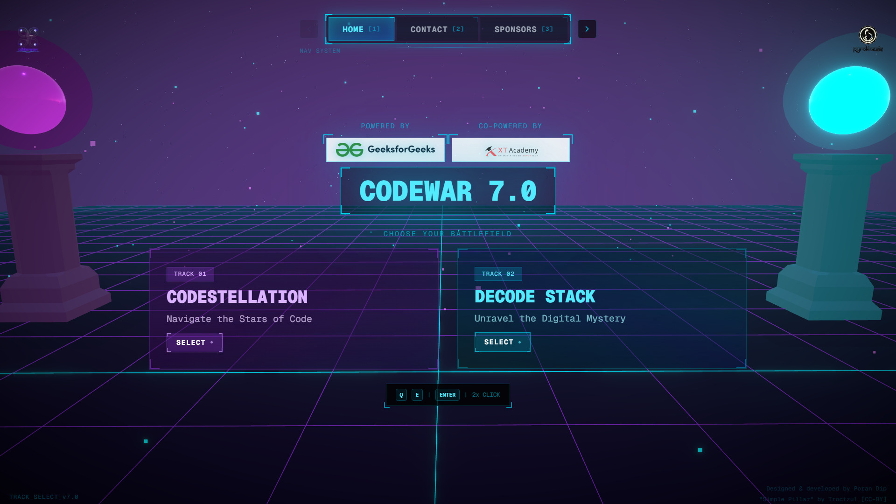

# CodeWar 7.0

Immersive event website for Pyrokinesis' annual coding competition, featuring a cyberpunk-themed 3D game-HUD UI with dynamic camera movement. Hosts two tracks — Codestellation and Decode Stack.

View it live at [codewar.aec.ac.in](https://codewar.aec.ac.in/).



---

## Features

- Cyberpunk-themed 3D scene built with Three.js and React Three Fiber
- Camera movement and animated HUD elements
- Secure countdown API for tamper-proof, timed problem statement release
- Responsive across all devices
- Adaptive 3D rendering based on device tier (mobile, tablet, and desktop)

---

## Tech Stack

- **Next.js** — framework and API routes
- **Three.js / React Three Fiber / Drei** — 3D scene and helpers
- **Motion** — animations
- **TailwindCSS** — styling
- **Zustand** — state management

---

## Setup

```bash
git clone https://github.com/poran-dip/codewar-7.git
cd codewar-7
npm install
npm run dev
```

Or with Docker:

```bash
docker build -t codewar .
docker run -p 3000:3000 codewar
```

---
